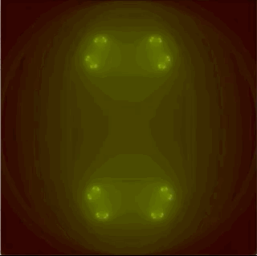
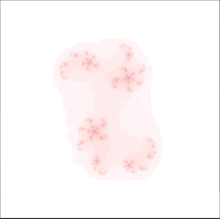

# Fractal explorer (Fractol)
A multi-threaded fractal explorer with image export & adjustable colors.


## Features
- Multithreaded
- Zooming in with mouse scroll
- Centering to mouse position on click
- Multiple Julia & Mandelbrot style fractals (9 in total)
- Mouse movement controls for Julia fractals
- Adjustable color palette & color palette size
- Adjustable colors via command line arguments
- Random colors though in the range of currently used colors
- Smooth colors
- Adjustable max iteration limit
- Adjustable powers (`z^pow`) on `mandelbrot_n` & `julia_n`
- High resolution `.bmp` image export
- Debugging UI displaying positional info & color palette (Toggle with `G`)
- Multiple windows, can open all fractals simultaneously



## Usage
```sh
git clone https://github.com/hakolao/fractal_explorer.git && make
# Default usage
./fractol

# With arguments:
./fractol julia -colors=255,0,0\|0,255,0\|0,0,255
```


### Argument options
```
all
mandelbrot (Default)
julia
burning_ship
mandelbrot_n
julia_n
bird_of_prey
julia_mod
phoenix_mod
burning_julia
-colors=255,22,22\|20,20,33
```

### Headers
Edit following macros in the `fractol.h` header file.
Note that with current design `HEIGHT / THREADS` should have no remainder.
`HEIGHT % THREADS` should be `0.`
```
// Resolution
# define WIDTH 1080
# define HEIGHT 1080

// Export image resolution
# define IMG_WIDTH 4096
# define IMG_HEIGHT 4096

// Thread number
# define THREADS 8
```




## Notes
This project was made as part of the graphics branch in Hive Helsinki.
Therefore the code follows 42's strict norms:
- Functions must not exceed 25 lines
- Max 5 functions in a .c file
- Cannot stick variable declaration and initialization on the same line
- Max 5 variables per block
- Max 4 parameters per function
- Forbidden keywords: `for`,  `do ... while`, `switch`, `case`, `goto`

Only existing C functions `exit`, `open`, `close`, `write`, `read`, `malloc`, `free`, and the functions of `minilibx (libmlx)` and `math.h` are allowed. Although other functions may be used in bonus features. Image export in this project's case used `fopen`, `fwrite` & `fclose`.


